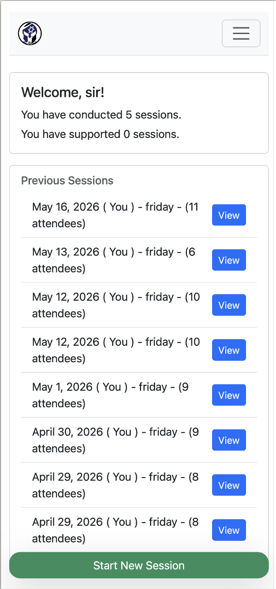
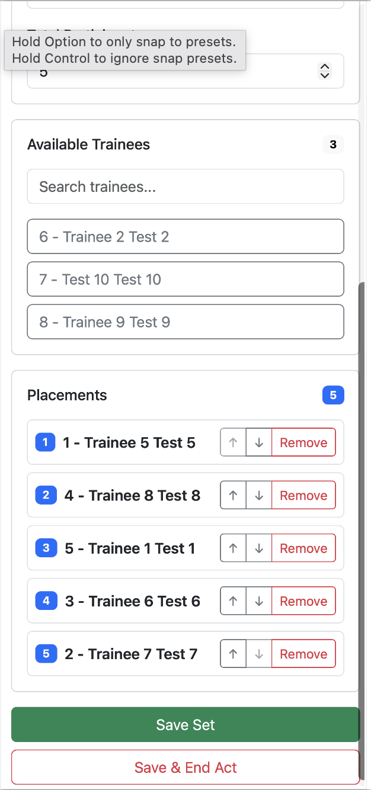
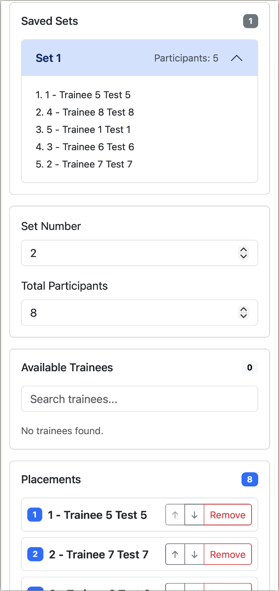
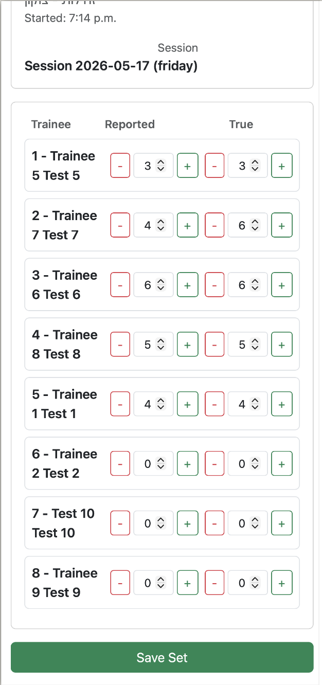
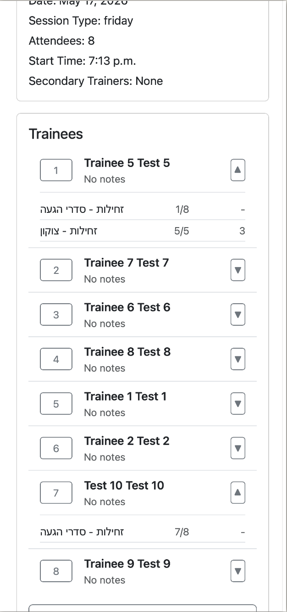
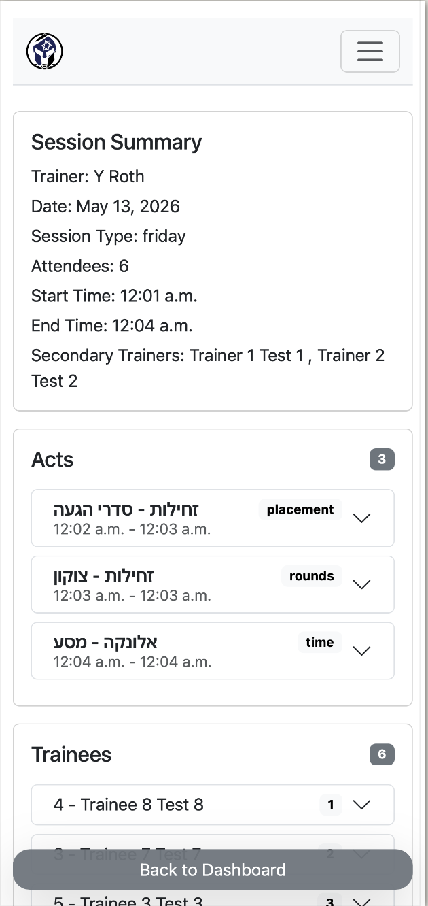

# Kosher Kravi

## Overview

Kosher Kravi is a Django-based operational management and performance tracking system built for a combat fitness training organization.

The system was designed to manage:
- training sessions
- trainee attendance
- exercise performance tracking
- trainer workflows
- alumni statistics
- long-term organizational performance analysis

A major focus of the system was tracking the progression and performance of active trainees across sessions while also maintaining long-term statistical data related to organizational outcomes and alumni success.

The platform was designed around operational usability, mobile-first workflows, and structured relational tracking of training activity and performance data.

---

## My Role

I designed and built the system around real operational training workflows, including:
- session management
- attendance tracking
- performance tracking
- trainer workflows
- exercise management
- relational database structure
- mobile-first operational flows
- backend architecture
- frontend workflow implementation

This was also the first major project where I actively integrated AI-assisted development workflows into the development process.

AI was primarily used to accelerate implementation speed, iteration, and repetitive development tasks, while architectural decisions, relational modeling, workflow logic, and operational design remained fully developer-driven.

---

## Operational Dashboard

## Goals

- Track trainee performance across training sessions
- Manage attendance and operational workflows
- Track exercise-specific performance data
- Support trainer operational workflows
- Maintain historical trainee progression data
- Track organizational and alumni performance statistics
- Simplify operational usage in mobile-first environments

---

## Architecture

### Backend
- Django

### Database
- PostgreSQL

### Frontend
- Bootstrap
- Vanilla JavaScript

### Deployment
- Railway

---

## Core Features

### Session Management

The system supports structured management of:
- training sessions
- trainers
- attendees
- activities
- exercise flows

Sessions are designed around operational usability and fast workflow execution during live training activity.

---

### Attendance Tracking

Tracks active trainees and session attendance across training history while maintaining long-term progression data.

---

### Exercise Performance Tracking

The system tracks trainee performance for different exercises and activities across sessions.

For each exercise, the system stores:
- participating attendees
- performance metrics
- repetitions
- times/results
- session context
- trainer-related operational data

This allows historical tracking of trainee progression over time.

---

### Alumni & Organizational Statistics

The platform also maintains long-term statistics related to organizational outcomes and alumni success metrics.

This allows tracking of broader organizational performance beyond individual sessions alone.

---

### Mobile-First Operational Workflows

A major focus of the system was operational usability in mobile-first environments.

The workflow design prioritized:
- fast data entry
- minimal friction
- structured navigation
- simplified operational interaction during live sessions

---

## Key Challenges

### Relational Workflow Design

The system required multiple interconnected relational workflows involving:
- sessions
- trainers
- attendees
- exercises
- performance tracking
- attendance history
- historical statistics

Designing relational structures that remained flexible while supporting operational simplicity was a major challenge.

---

### Operational Simplicity

The underlying relational logic was complex, but the user experience needed to remain fast and intuitive during live operational usage.

This required carefully structuring workflows around real-world operational behavior rather than purely technical structure.

---

### Performance Tracking Flexibility

Different exercises required tracking different forms of performance data.

The system needed to remain flexible enough to support:
- varying exercise structures
- changing operational workflows
- multiple result formats
- historical progression analysis

---

### Mobile Usability

Since the system was frequently used during live operational activity, interfaces needed to remain efficient and usable on mobile devices.

---

## Solutions

### Structured Relational Models

Designed relational models around operational workflows rather than purely static data structures.

### Guided Operational Flows

Built multi-step guided workflows for:
- session creation
- attendance tracking
- exercise management
- performance entry
- session completion

### Flexible Exercise Tracking

Implemented exercise structures capable of supporting different forms of performance tracking while maintaining historical consistency.

### Mobile-Focused UX

Focused heavily on reducing friction and simplifying operational interaction patterns in mobile environments.

---

## AI-Assisted Development

This project was the first major system where I actively incorporated AI-assisted development into my workflow.

AI-assisted tooling was primarily used to:
- accelerate implementation
- speed up iteration
- assist with repetitive development tasks
- explore alternative implementation approaches

while architecture, workflow design, relational structure, and operational logic remained developer-driven.

The project also became part of my process for learning how to effectively integrate modern AI tooling into real-world software development workflows.

---

## What I Learned

This project significantly improved my understanding of:
- mobile-first workflow systems
- AI-assisted development workflows

---

## Tech Stack

- Python
- JavaScript
- Django
- PostgreSQL
- Bootstrap
- Railway
