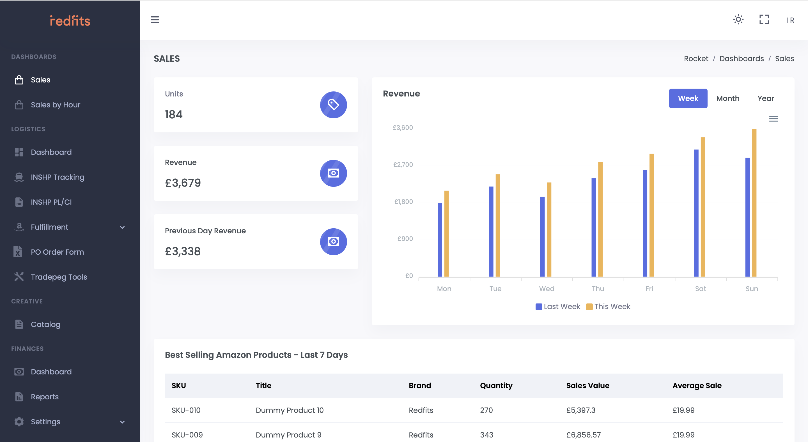
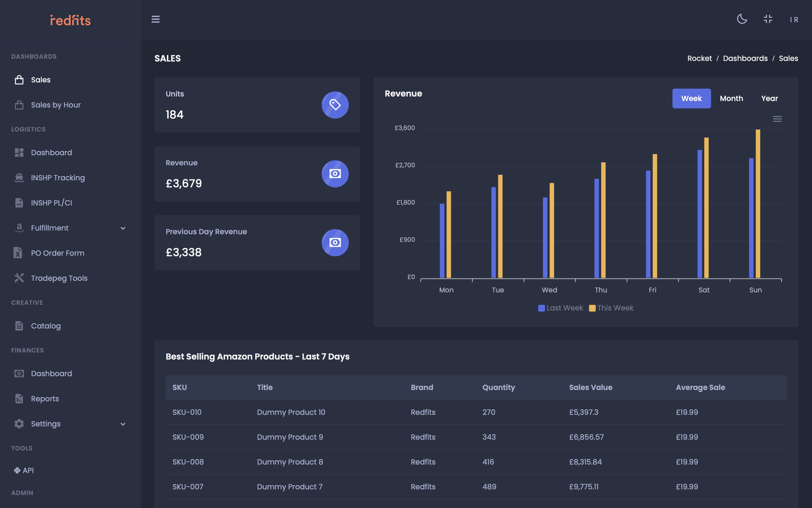
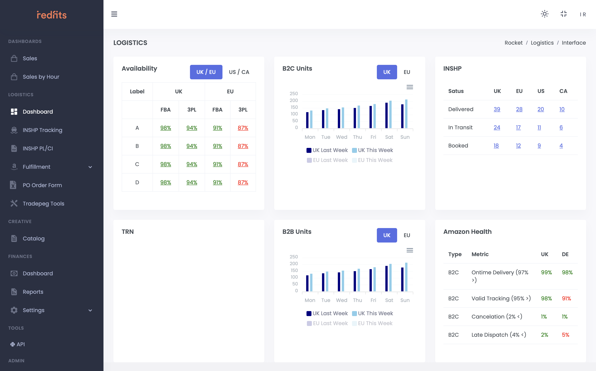
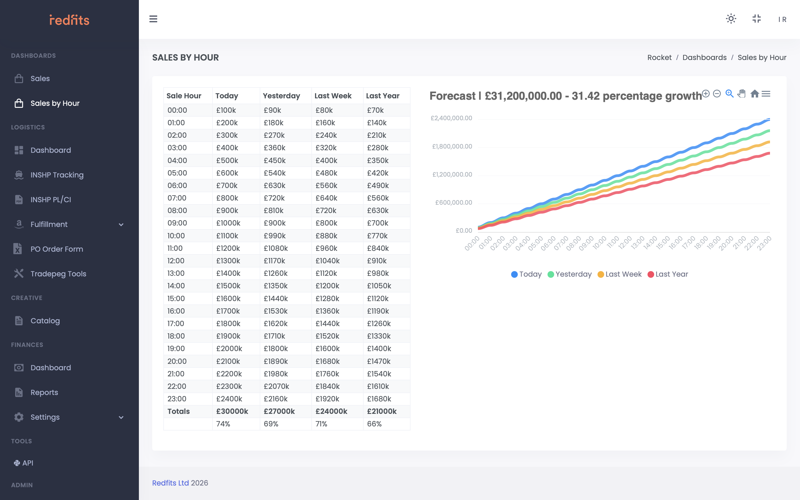

# Rocket

## Overview

Rocket is an internal operations platform designed to simplify and automate workflows related to Amazon marketplace operations and internal business processes.

The platform was used daily by approximately 20 employees and acted as a simplified operational layer over Amazon Seller Central while also providing internal automation tools and workflow management.

Originally, Rocket existed as a relatively small Flask application. Over multiple years of development, I expanded it into a significantly larger internal platform handling operational workflows, automation, and business tooling.

---

## Operational Dashboard

---

## Goals

- Simplify operational workflows
- Reduce repetitive manual work
- Centralize internal operations
- Extend functionality beyond Amazon Seller Central
- Improve operational efficiency for employees

---

## Core Features

### Workflow Automation

Created internal tools that automated repetitive operational tasks and reduced manual interaction with Amazon systems.

### Operational Dashboard

Built interfaces tailored specifically to the company’s workflows instead of relying directly on Amazon Seller Central.

### Internal Business Tooling

Developed operational tools that supported day-to-day workflows and business processes.

### Extended Functionality

Implemented features and workflows that were not available natively through Amazon’s own tooling.

---

## System Evolution

Rocket originally began as a relatively small Flask application. Over multiple years of development, I expanded it into a significantly larger operational platform handling internal workflows, automation, and operational tooling across multiple business domains.

---

## Key Challenges

### Simplifying Complex External Workflows

Amazon Seller Central workflows were often inefficient and difficult for employees to work with directly.

The challenge was creating simplified internal workflows without losing flexibility.

### Reliability

Since the platform was used daily by employees, operational stability and reliability were critical.

### Flexibility

Different operational flows required tooling that could adapt to changing business requirements without tightly coupling logic to one specific process.

---

## Solutions

- Built tailored internal operational tooling
- Automated repetitive workflows
- Created simplified interfaces over complex external systems
- Structured the application around operational usability

---

## What I Learned

This project significantly improved my understanding of:
- operational workflow design
- internal tooling architecture
- scaling long-term Flask applications
- production infrastructure management
- designing systems around real business usage

---

## What I’d Improve Now

- More modular frontend/backend structure

---

## Tech Stack

- Python
- JavaScript
- Flask
- MSSQL
- AWS Elastic Beanstalk
- GitHub Actions